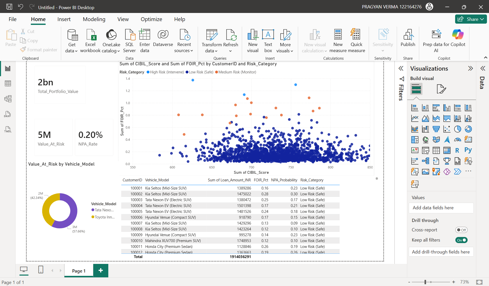

# 🏦 Automated NBFC Risk Command Center

## 📌 Project Overview
An end-to-end Risk Analytics and Data Engineering pipeline built for a fictional Indian Non-Banking Financial Company (NBFC). This project simulates the complete lifecycle of auto-finance risk management—from synthesizing realistic loan origination data and predicting 90-day Non-Performing Assets (NPAs) using Machine Learning, to deploying a live Business Intelligence command center.

**Key Achievements:**
* **Engineered a 1,500-profile relational database** mapping complex Indian banking metrics including LTV (Loan-to-Value) and FOIR (Fixed Obligation to Income Ratio).
* **Architected an XGBoost predictive model** achieving an ROC-AUC of 0.99 for early default detection, resolving class imbalances using weighted algorithmic scaling.
* **Developed an automated Power BI Executive Dashboard** utilizing custom DAX to dynamically calculate portfolio Value at Risk (VaR) and isolate high-risk accounts for field intervention.

---

## 🛠️ Technology Stack
* **Data Architecture & ETL:** Python (Pandas, NumPy), SQLite3
* **Machine Learning:** Scikit-Learn, XGBoost Classifier
* **Business Intelligence:** Power BI (Custom DAX, Conditional Formatting)
* **Financial Modeling:** Monte Carlo Simulations, RBI Macro-Stress Testing

---

## 🏗️ System Architecture

### 1. Data Layer (ETL & SQL)
Engineered an automated Python pipeline (`nbfc_risk_pipeline.py`) that generates hyper-realistic demographic and asset data (Tata, Mahindra, Maruti, etc.). Calculates exact EMIs using risk-adjusted interest rate slabs and loads normalized data into a SQLite backend.

### 2. Compute Layer (Machine Learning)
Developed an Early Warning System (EWS) to predict defaults before they happen.
* Applied **Explainable AI (XAI)** to identify FOIR and CIBIL density as the primary drivers of portfolio risk.
* Simulated a macro-economic stress test simulating a 100 bps RBI Repo Rate hike to quantify incremental capital erosion.

### 3. Presentation Layer (Power BI)
A fully interactive executive command center designed for a Chief Risk Officer (CRO).
* Features dynamic DAX calculations for **Total Portfolio Value**, **Value at Risk (VaR)**, and **Required Cash Provisioning**.
* Deploys an automated "Operational Hitlist" utilizing conditional formatting to trigger immediate repossession or field agent visits based on predictive ML probabilities.

---

## 📊 Key Insights & Analytics
1. **The Danger Zone:** The Power BI scatter matrix clearly isolates accounts with a CIBIL < 700 and FOIR > 40% as the primary drivers of NPA probability.
2. **Asset Class Exposure:** Segment analysis reveals specific vehicle models (e.g., Luxury SUVs) carrying disproportionate Value at Risk relative to portfolio volume.
3. **Operational Efficiency:** The automated hitlist extraction pipeline filters 1,500 active accounts down to the specific <1% requiring immediate field intervention, optimizing collections OPEX.

---
*Built by Pragyan Verma — Transitioning Engineering logic into Financial Data Science.*
